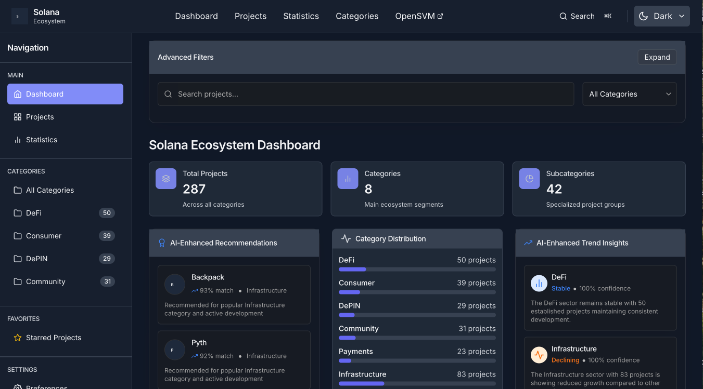

# Solana Ecosystem Landscape

A comprehensive, interactive dashboard for exploring and analyzing projects in the Solana blockchain ecosystem. This application provides an intuitive interface for discovering, filtering, and gaining insights into the diverse range of projects built on Solana.



## Features

### Core Features

- **Interactive Dashboard**: Visualize the entire Solana ecosystem with an intuitive, responsive interface
- **Advanced Filtering**: Filter projects by multiple categories, tags, and attributes
- **Detailed Project Information**: View comprehensive details about each project
- **Theme Support**: Choose between Dark, Light, and Blue themes with smooth transitions
- **Responsive Design**: Optimized for all device sizes from mobile to desktop
- **Command Palette**: Quick keyboard-driven navigation and search (Press Ctrl+K)

### AI-Enhanced Features

- **Project Recommendations**: Personalized project suggestions based on browsing history and selected categories
- **Trend Analysis**: AI-driven insights into emerging patterns in the Solana ecosystem
- **Enhanced Search**: Intelligent search with semantic matching rather than just keywords
- **Related Projects**: Discover similar projects based on AI-powered similarity analysis

### UI/UX Highlights

- **Glassmorphism Effects**: Modern glass-like UI elements for forms and modals
- **Professional Color Palettes**: Carefully designed color schemes for all themes
- **Micro-interactions**: Subtle animations and transitions for a polished experience
- **Accessibility**: WCAG AA compliant contrast ratios and keyboard navigation

## Getting Started

### Prerequisites

- Node.js 18.x or higher
- pnpm (recommended) or npm

### Installation

1. Clone the repository:
   ```bash
   git clone https://github.com/openSVM/landscape.git
   cd landscape
   ```

2. Install dependencies:
   ```bash
   pnpm install
   # or
   npm install
   ```

3. Start the development server:
   ```bash
   pnpm dev
   # or
   npm run dev
   ```

4. Open your browser and navigate to `http://localhost:5173`

### Building for Production

```bash
pnpm build
# or
npm run build
```

The build artifacts will be stored in the `dist/` directory.

## Architecture

### Technology Stack

- **Frontend Framework**: React 18 with TypeScript
- **Build Tool**: Vite
- **Styling**: Tailwind CSS with custom theme variables
- **UI Components**: Custom components with Radix UI primitives
- **Charts & Visualization**: Recharts and Chart.js
- **State Management**: React Context API
- **Form Handling**: React Hook Form with Zod validation

### Project Structure

```
solana-landscape-app/
├── public/                  # Static assets
├── src/
│   ├── assets/              # Project-specific assets
│   ├── components/          # React components
│   │   ├── ui/              # Reusable UI components
│   │   └── ...              # Feature-specific components
│   ├── contexts/            # React context providers
│   ├── hooks/               # Custom React hooks
│   ├── lib/                 # Utility functions
│   ├── services/            # API and service integrations
│   ├── App.tsx              # Main application component
│   ├── index.css            # Global styles
│   ├── glassmorphism.css    # Glass effect styles
│   ├── main.tsx             # Application entry point
│   └── types.ts             # TypeScript type definitions
├── .gitignore               # Git ignore file
├── index.html               # HTML entry point
├── package.json             # Project dependencies and scripts
├── postcss.config.js        # PostCSS configuration
├── tailwind.config.js       # Tailwind CSS configuration
├── tsconfig.json            # TypeScript configuration
└── vite.config.ts           # Vite configuration
```

## Theming System

The application features a robust theming system with three professional color palettes:

### Light Theme (Professional & Clean)
- Background with subtle blue undertones for a premium feel
- Deep, rich dark grays with blue undertones for text
- Sophisticated indigo accent palette that conveys trust and professionalism

### Dark Theme (Professional & Elegant)
- Rich dark blue-gray background that reduces eye strain
- Carefully balanced whites and grays for optimal readability
- Vibrant but sophisticated indigo accents

### Blue Theme (Professional & Vibrant)
- Subtle indigo-tinted backgrounds that reinforce brand identity
- Deep slate blue text for excellent contrast
- Rich, deep indigo accents that provide strong brand identity

### Theme Implementation

The theme system uses CSS variables for consistent styling across the application. Themes can be toggled using the theme selector in the header, and your preference is saved between sessions.

```css
/* Example of theme variables */
:root {
  --background: rgb(250, 250, 252);
  --surface: rgb(255, 255, 255);
  --primary: rgb(51, 51, 64);
  --accent: #4F46E5;
  /* Additional variables... */
}

.theme-dark {
  --background: rgb(17, 24, 39);
  --surface: rgb(31, 41, 55);
  --primary: rgb(243, 244, 246);
  --accent: #6366F1;
  /* Additional variables... */
}

.theme-blue {
  --background: rgb(238, 242, 255);
  --surface: rgb(255, 255, 255);
  --primary: rgb(30, 41, 59);
  --accent: #3730A3;
  /* Additional variables... */
}
```

## AI Features

The application includes several AI-enhanced features:

### Project Recommendations
AI-powered recommendations suggest relevant projects based on browsing history and selected categories, displayed on the Dashboard.

### Trend Analysis
AI-driven trend analysis identifies emerging patterns in the Solana ecosystem, shown in the Statistics panel with visual indicators.

### Enhanced Search
The search functionality uses AI to provide more intelligent results with semantic matching rather than just keyword matching.

### Project Similarity
AI-based similarity analysis between projects powers the "Related Projects" feature in the Project Modal.

## Accessibility

The application is designed with accessibility in mind:

- All color combinations meet WCAG AA contrast requirements
- Interactive elements have distinct focus and hover states
- Color is not the sole means of conveying information
- Keyboard navigation is fully supported
- Screen reader friendly markup

## Contributing

We welcome contributions to the Solana Ecosystem Landscape project! Please follow these steps:

1. Fork the repository
2. Create a feature branch: `git checkout -b feature/amazing-feature`
3. Commit your changes: `git commit -m 'Add amazing feature'`
4. Push to the branch: `git push origin feature/amazing-feature`
5. Open a Pull Request

### Development Guidelines

- Follow the existing code style and organization
- Write clean, maintainable, and testable code
- Update documentation for any new features or changes
- Ensure all themes work correctly with your changes
- Test on multiple device sizes for responsive design

## License

This project is licensed under the MIT License - see the LICENSE file for details.

## Acknowledgments

- The Solana Foundation and community
- All contributors who have helped improve this project
- The creators of the open-source libraries used in this project
